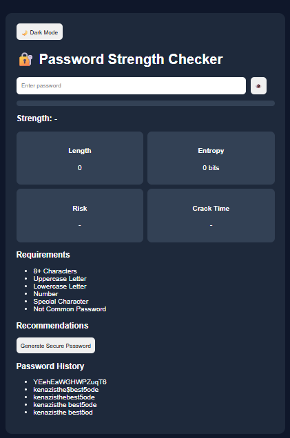
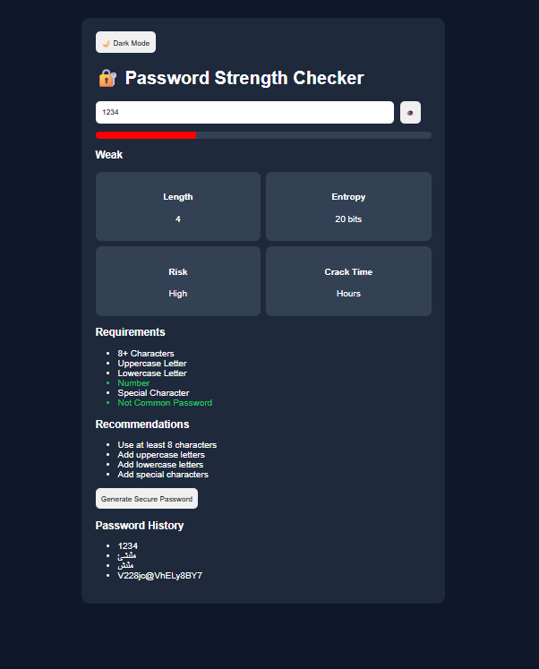
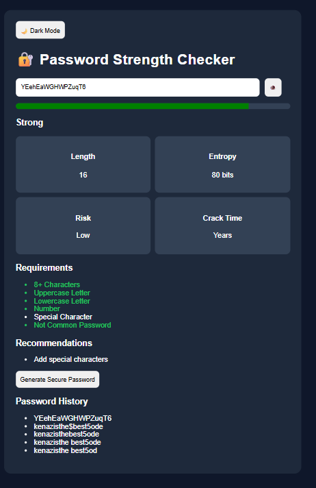

# Password-Strength-Checker
Cybersecurity tool that evaluates password strength, estimates crack time, calculates entropy, and generates secure passwords.
# 🔐 Password Strength Checker

A cybersecurity tool that evaluates password strength using security best practices.

## Features

- Password Strength Detection
- Entropy Score Calculator
- Crack Time Estimation
- Password Generator
- Show / Hide Password
- Dark / Light Mode
- Password History
- Security Recommendations

## Screenshots

### Home Screen

### Weak Password Example

### Strong Password Example

### Password Generator

## Technologies

- HTML
- CSS
- JavaScript
- Regex

## Author

Kenaz Halwai
Computer Science Student | Cybersecurity Enthusiast
